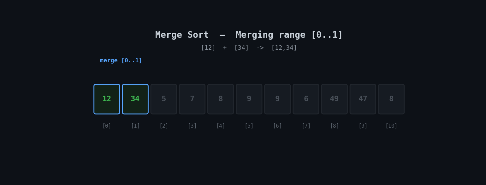

<h1 align="center">🔀 Merge Sort</h1>

<p align="center">
  <i>An animated, beginner-friendly walkthrough of the Merge Sort algorithm with a clean recursive Python implementation.</i>
</p>

<p align="center">
  
  
  
</p>

---

## 📽️ Visual Walkthrough

Merge Sort is a **divide-and-conquer** algorithm: it splits the array in half recursively down to single elements, then merges those pieces back together in sorted order, one pair of sub-arrays at a time.

<p align="center">
  
</p>

> 🔵 Blue = range currently being merged · 🟢 Green = merge complete / fully sorted · ⚫ Dim = not part of this merge step yet

---

## ⚙️ How It Works

1. If the array has more than one element, split it into two halves.
2. Recursively sort the left half, then recursively sort the right half.
3. **Merge** the two now-sorted halves back together: repeatedly compare the front of each half and place the smaller value next.
4. Once one half is exhausted, copy over whatever remains of the other.

The animation shows every merge step in the exact order the recursion performs them — smallest sub-arrays merge first, building up to the final full-array merge.

---

## ⏱️ Complexity

| Case | Time | Space |
|---|---|---|
| Best | `O(n log n)` | `O(n)` |
| Average | `O(n log n)` | `O(n)` |
| Worst | `O(n log n)` | `O(n)` |

Merge Sort's time complexity is **consistent across all cases** — unlike Bubble, Selection, or Insertion Sort, the input order doesn't change how many comparisons it makes. The trade-off is `O(n)` extra space, since merging needs temporary arrays to hold the two halves.

---

## 🐍 Implementation

```python
def merge_sort(arr):
    if len(arr) > 1:
        mid = len(arr) // 2
        left = arr[:mid]
        right = arr[mid:]
        merge_sort(left)
        merge_sort(right)

        i = j = k = 0
        while i < len(left) and j < len(right):
            if left[i] <= right[j]:
                arr[k] = left[i]
                i += 1
            else:
                arr[k] = right[j]
                j += 1
            k += 1
        while i < len(left):
            arr[k] = left[i]
            i += 1
            k += 1
        while j < len(right):
            arr[k] = right[j]
            j += 1
            k += 1


nums = [12, 34, 5, 7, 8, 9, 9, 6, 49, 47, 8]
merge_sort(nums)
print(nums)
```

> 💡 Full file: [`merge_sort.py`](./merge_sort.py)

---

## ▶️ Run It

```bash
git clone https://github.com/zain-cs/9-Merge-Sort.git
cd 9-Merge-Sort
python merge_sort.py
```

---

## 🔁 Merge Sort vs. the Simpler Sorts

| | Bubble / Selection / Insertion | Merge Sort |
|---|---|---|
| Time complexity | `O(n²)` average/worst | `O(n log n)` always |
| Space complexity | `O(1)` — in place | `O(n)` — needs extra arrays |
| Strategy | Compare & swap adjacent elements | Divide, conquer, merge |
| Stable? | Bubble & Insertion: ✅, Selection: ❌ | ✅ Yes |
| Good for | Small or nearly-sorted data | Large datasets where `O(n log n)` matters |

Merge Sort is the algorithm behind Python's own `sorted()` and `list.sort()` (technically Timsort, a hybrid of Merge Sort and Insertion Sort) — understanding it is a real step toward understanding production sorting.

---

## 🗺️ Part of a DSA Series

📌 [Linear Search](https://github.com/zain-cs/1-Linear-Search) → [Binary Search](https://github.com/zain-cs/2-Binary-Search) → [Ternary Search](https://github.com/zain-cs/3-Ternary-Search) → [Jump Search](https://github.com/zain-cs/4-Jump-Search) → [Exponential Search](https://github.com/zain-cs/5-Exponential-Search) → [Bubble Sort](https://github.com/zain-cs/6-Bubble-Sort) → [Selection Sort](https://github.com/zain-cs/7-Selection-Sort) → [Insertion Sort](https://github.com/zain-cs/8-Insertion-Sort) → **Merge Sort** → more to come as I work through DSA.

---

<p align="center">
  Made with 🐍 by <a href="https://github.com/zain-cs">Muhammad Zain Ul Abidin</a>
</p>
